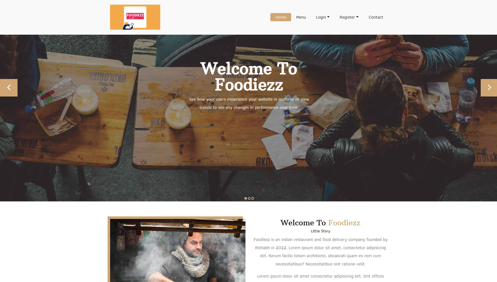
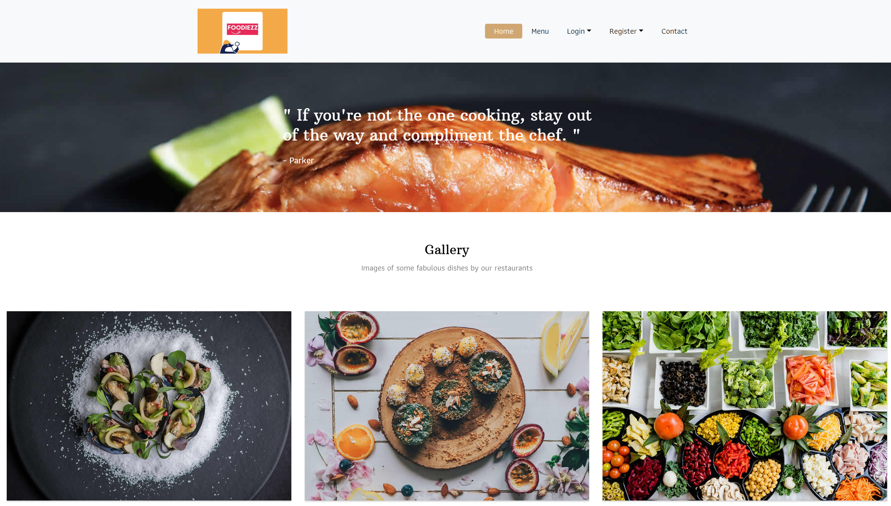
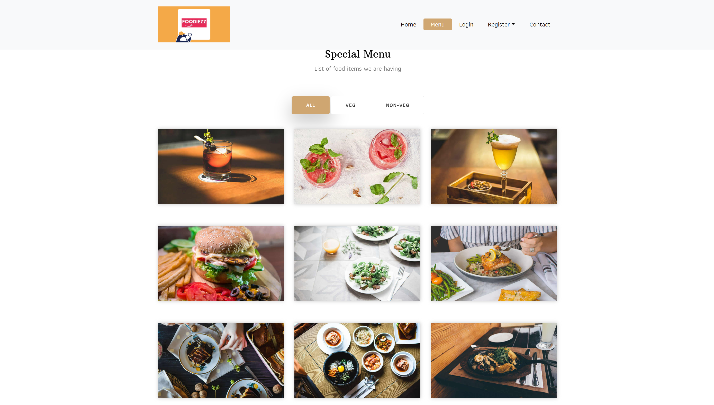

# 🍽️ Foodiezz

**Live Demo:** [foodiezz-restaurant-website.vercel.app](https://foodiezz-restaurant-website.vercel.app)

Foodiezz is a modern, responsive restaurant website designed to showcase your culinary offerings and attract more customers. Built with HTML, CSS, and JavaScript, it provides an engaging user experience across devices.

---

## 📸 Preview

## Home Page


## Gallery Section


## Menu Section


---

## ✨ Features

* **Responsive Design:** Seamless experience on desktops, tablets, and mobile devices.
* **Interactive Menu:** Browse through various food categories with ease.
* **Blog Section:** Share news, recipes, and updates with your audience.
* **Contact Form:** Allow customers to get in touch effortlessly.
* **User Authentication:** Login functionality for personalized experiences.

---

## 🛠️ Technologies Used

* **HTML5 & CSS3:** Structured and styled content.
* **JavaScript:** Interactive elements and dynamic content.
* **Vercel:** Deployment platform for hosting.

---

## 🚀 Getting Started

To run this project locally:

1. **Clone the repository:**

   ```bash
   git clone https://github.com/rishabh6512/Foodiezz.git
   ```

2. **Navigate to the project directory:**

   ```bash
   cd Foodiezz
   ```

3. **Open `index.html` in your preferred browser:**

   ```bash
   open index.html
   ```

   Or, you can use the Live Server extension in VS Code for a better development experience.

---

## 📂 Project Structure

```
Foodiezz/
├── css/
│   └── style.css
├── fonts/
├── images/
├── js/
├── about.html
├── blog-details.html
├── blog.html
├── contact.html
├── index.html
├── menu.html
└── README.md
```

---

## 📬 Contact

For any inquiries or feedback:

* **GitHub:** [@rishabh6512](https://github.com/rishabh6512)
* **Email:** [rishabhrishabh546@gmail.com](mailto:rishabhrishabh546@gmail.com)

---

## 📄 License

This project is open-source and available under the [MIT License](LICENSE).
